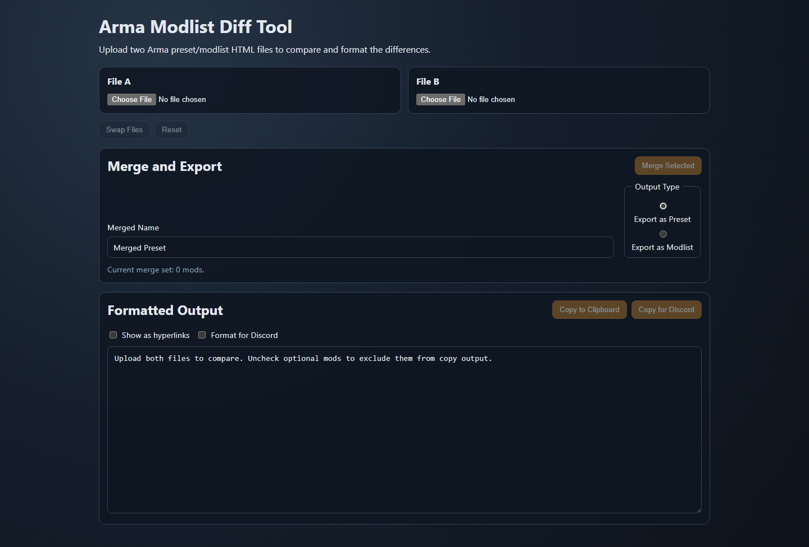
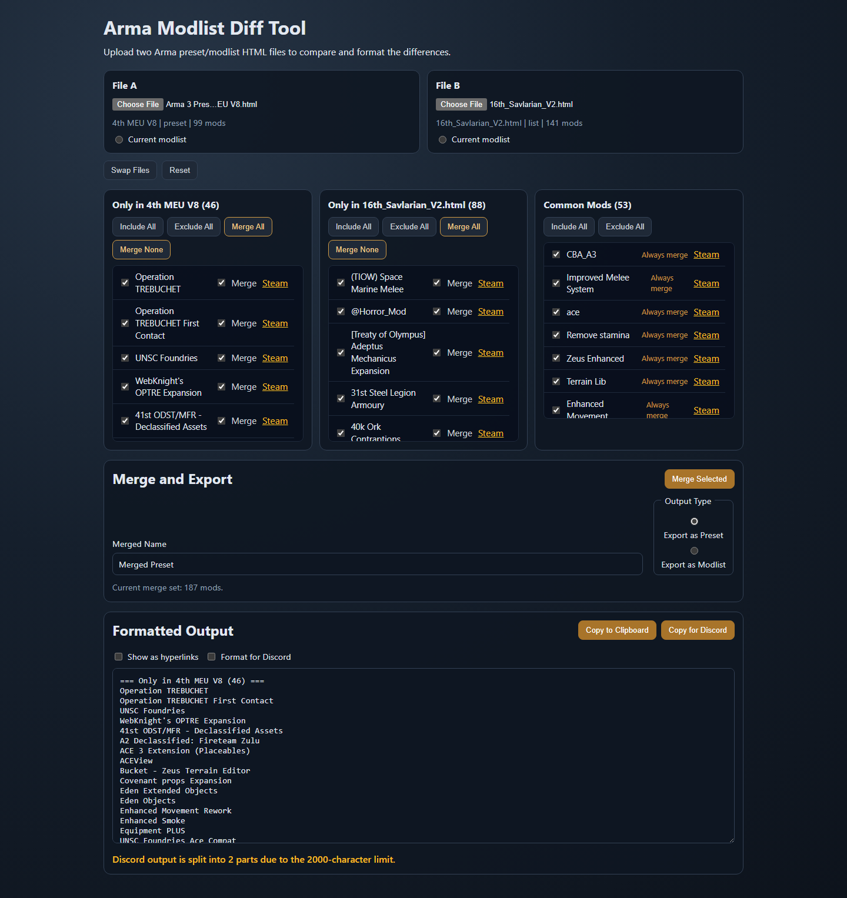
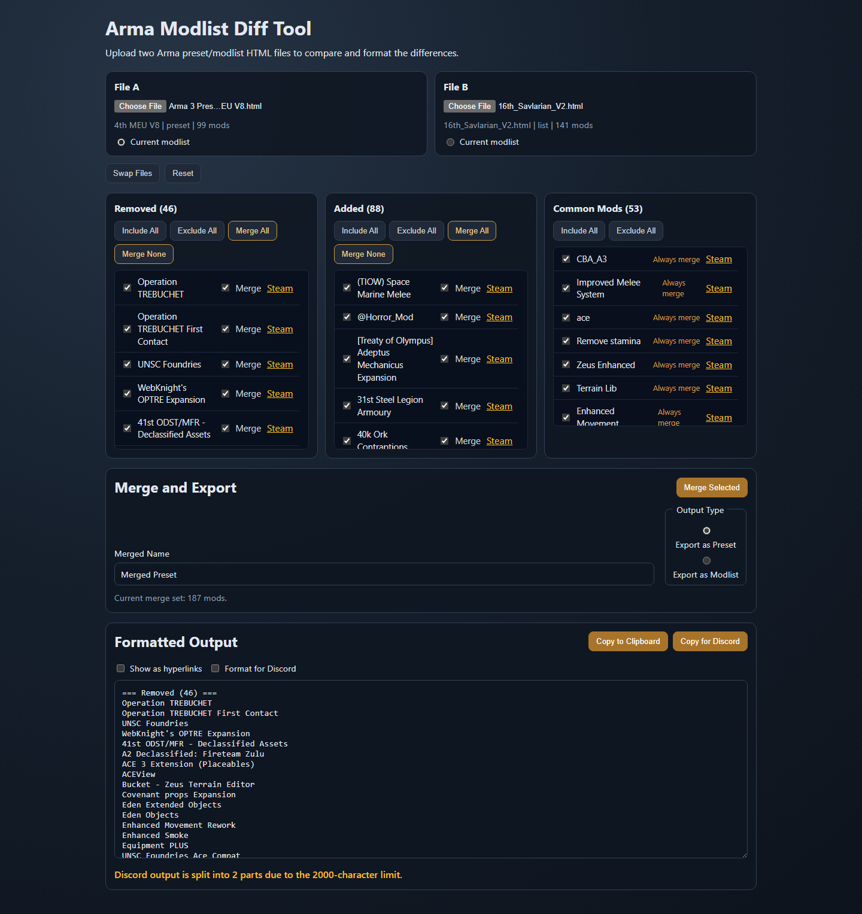
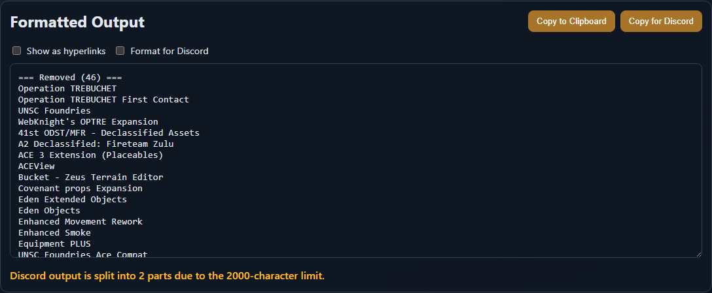

# This is vibe coded slop done mostly as an experiment. Use at your own risk.

# Arma Modlist Diff Tool

Browser-based Arma 3 modlist/preset comparison tool with a reusable TypeScript core module.

## What it does

- Accepts two Arma Launcher HTML exports (`preset` or `list`).
- Parses and diffs mods by Steam Workshop ID (with a fallback identity strategy).
- Shows differences with per-mod include/exclude controls.
- Supports baseline mode ("Current modlist") for directional `Added`/`Removed` labels.
- Exports formatted output for plain text and Discord.
- Merges selected mods into a new Arma-importable HTML preset/modlist.

## Project status

- Web app: feature-complete through Phase 2.
- Deployment automation: configured for GitHub Pages in CI.
- Core package: publish-ready but intentionally not published yet.

Expected GitHub Pages URL after first `main` deployment:

- `https://val9thou.github.io/AMDMtools/`

## Screenshots







## Monorepo layout

```text
.
|- src/                 # React web app
|- packages/core/       # Reusable parser/diff/formatter/merge module
|- test-fixtures/       # Arma preset/list fixture HTML files
|- e2e/                 # Playwright end-to-end tests
|- docs/                # Build schedules + project documentation
```

## Quick start (local development)

### Requirements

- Node.js 22+
- npm 10+

### Install

```bash
npm install
```

### Run the app

```bash
npm run dev
```

### Test and validate

```bash
npm run lint
npm test
npm run build
npm run test:e2e
```

## Core module usage

The core module lives in `packages/core` and is intended for reuse by other tools.

See full API docs here:

- `docs/CORE_API.md`

The package is currently marked private to prevent accidental publish. When you are ready to publish, remove `"private": true` from `packages/core/package.json`.

## Deployment

GitHub Actions workflow:

- Runs lint/tests on PRs.
- Builds and deploys to GitHub Pages on `main`.

Primary CI file:

- `.github/workflows/ci.yml`

## Contributing

See:

- `CONTRIBUTING.md`
